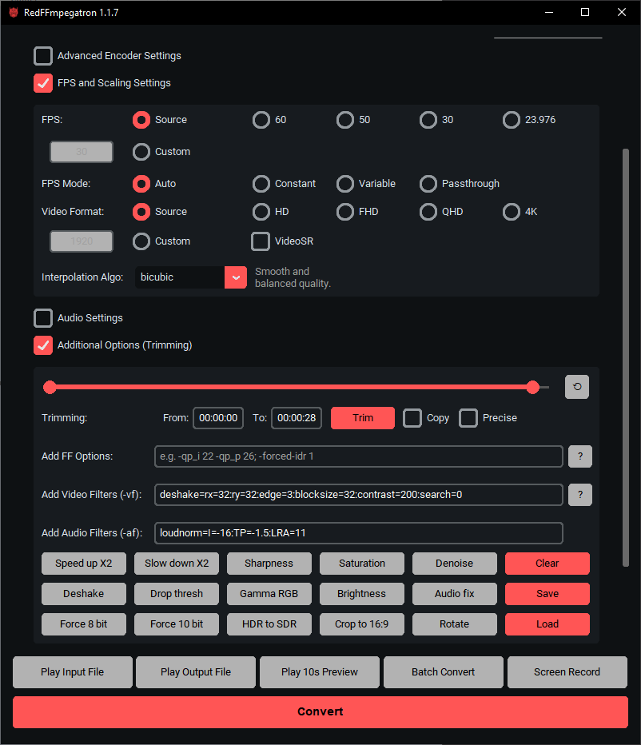
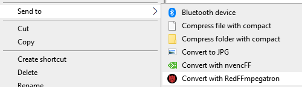

# RedFFmpegatron 🚀

A Python GUI for **FFmpeg** with **AMD AMF hardware encoding** (HEVC / H.264 / AV1).  
It provides a simple dark-themed interface with drag-and-drop support, presets, trimming, previews, and advanced encoder/audio/FPS options – no need to manually write FFmpeg commands.

---

## Features

- **Drag and drop** video files into the window
- **Codec support:** HEVC (H.265), H.264, AV1 via AMF
- **Bitrate mode** or **Constant QP mode**
- **Audio settings:** disable, copy, AAC (96k / 160k / 256k) or custom
- **Advanced encoder options:**
  - Usage (transcoding, lowlatency, ultralowlatency, high_quality, etc.)
  - Quality presets (speed, balanced, quality)
  - Profiles (main, main10)
  - Levels and tiers
  - Rate-control (cbr, vbr, hqvbr, qvbr, etc.)
  - AMF-specific toggles: Preanalysis, VBAQ, Enforce HRD
- **FPS and scaling settings**
  - Change FPS (source, 60, 50, 30, 23.976, custom)
  - Resize to HD/FHD/QHD/4K/Custom width
  - Interpolation algorithms (bilinear, bicubic, lanczos, spline, etc.)
- **VideoSR (super-resolution)**
  - Algorithms, sharpness, ratio controls, pixel format selection
- **Additional options**
  - Trimming with start/end time
  - Streamcopy mode
  - Add custom FFmpeg options
  - Video filters (crop, eq, unsharp, saturation, HDR→SDR, etc.)
  - Audio filters (atempo, loudnorm, etc.)
- **Presets system** for quick configuration
- **10-second preview** encoding with current settings
- **Estimated output size** (bitrate mode only)
- **Built-in player buttons:** Play Input, Play Preview, Play Output
- **Command preview** – shows full FFmpeg command, editable, copyable



---

## Getting Started

### Prerequisites

To use the RedFFmpegatron, you will need:

* **Windows Operating System:** The application is built for Windows 10/11.
* **FFmpeg:** You need to have FFmpeg installed on your system and its executable (`ffmpeg.exe`) accessible in your system's PATH, or specify its path within the application.
FFmpeg Windows builds links: [Windows builds from gyan.dev](https://www.gyan.dev/ffmpeg/builds/) or [Windows builds by BtbN](https://github.com/BtbN/FFmpeg-Builds/releases)
* **AMD GPU with AMF Support:** For hardware-accelerated encoding, an AMD graphics card with AMF capabilities is required. Ensure you have the latest AMD GPU drivers installed.

### Installation

#### 1. Download the Executable (Recommended) 🚀

The easiest way to get started is to download the latest release executable (`.exe`) from the [Releases](https://gitlab.com/hadoukez/redffmpegatron/-/releases) page.

1.  Go to the [Releases](https://gitlab.com/hadoukez/redffmpegatron/-/releases) section of this GitLab repository.
2.  Download the `RedFFmpegatron.exe` file.
3.  Run the executable.

#### 2. Run from Source (For Developers) 🔧

If you want to run the application from its Python source code:

1.  **Clone the repository:**
    ```
    git clone https://gitlab.com/hadoukez/RedFFmpegatron.git
    cd RedFFmpegatron
    ```
2.  **Install dependencies:**
    The project uses `customtkinter`, `CTkToolTip`, `pywin32` (for `win32gui`, `win32con`, `win32api`).
    ```bash
    pip install customtkinter CTkToolTip pywin32
    ```
3.  **Run the application:**
    ```
    python "RedFFmpegatron.py"
    ```

### Building Executable (For Developers) 🔧

You can compile the Python script into a standalone Windows executable (`.exe`) using **Nuitka**.

1.  **Install Nuitka:**
    ```
    pip install nuitka
    ```
2.  **Build the executable:**
    Navigate to the project's root directory in your terminal and run the following command. This command configures Nuitka to create a standalone, single-file executable with disabled console mode, include necessary packages, set application metadata, and specify an icon.

    ```
      python -m nuitka --msvc=latest --standalone --windows-console-mode=disable ^
      --include-package=customtkinter --enable-plugin=tk-inter ^
      --windows-icon-from-ico="icon.ico" ^
      --include-data-file=icon.ico=./ ^
      --include-data-file=rff-help.txt=./rff-help.txt ^
      --product-name="RedFFmpegatron" ^
      --product-version="1.0.4" ^
      --file-version="1.0.4" ^
      --file-description="RedFFmpegatron" ^
      --company-name="Deepseek Enjoyer" ^
      --copyright="Copyright (C) 2025 hadouken" ^
      --output-dir=build "RedFFmpegatron.py"
    ```
    The compiled executable will be found in the `build` directory specified by `--output-dir`.

---

## Usage 🎥

1.  **Launch the application:** Run the `.exe` file or `RedFFmpegatron.py`.
2.  **Select Input File:** Click the "Browse Input" button or drag and drop your video file into the designated area.
3.  **Specify Output File:** Click "Browse Output" to choose where to save your processed video and what to name it.
4.  **Configure Options:**
    * **Trim Video:** Enter the `Start Time` and `End Time` in `HH:MM:SS` format to trim your video.
    * **Encoder:** Select your desired video encoder (e.g., `hevc_amf`, `h264_amf`, `av1_amf`).
    * **Additional FFmpeg Options:** Add any extra FFmpeg commands you need (e.g., `e.g. -qp_i 22 -qp_p 26; -forced-idr 1`).
5.  **Start Processing:** Click the "Convert" button to begin the video encoding.
6.  **Monitor Progress:** The console output within the application will show the FFmpeg progress.

---

##  Easy access via Windows "Send to" context menu 📁



1. Press **Win+R**, type:
   ```
   %APPDATA%\Microsoft\Windows\SendTo
   ```
2. Modify APP_PATH in "Send to RedFFmpegatron.bat" script and create shortcut to it here.
3. You can rename it and set custom icon.

---

## Contributing

If you have a suggestion that would make this better, you can simply open an issue with the tag "enhancement" or "bug".

## Notes

- This app is designed for AMD GPUs that support **AMF hardware encoding**.
- For NVIDIA GPUs use [nvencFF Toolbox](https://gitlab.com/hadoukez/nvencff-toolbox).
- The tool is intended for Windows only.
