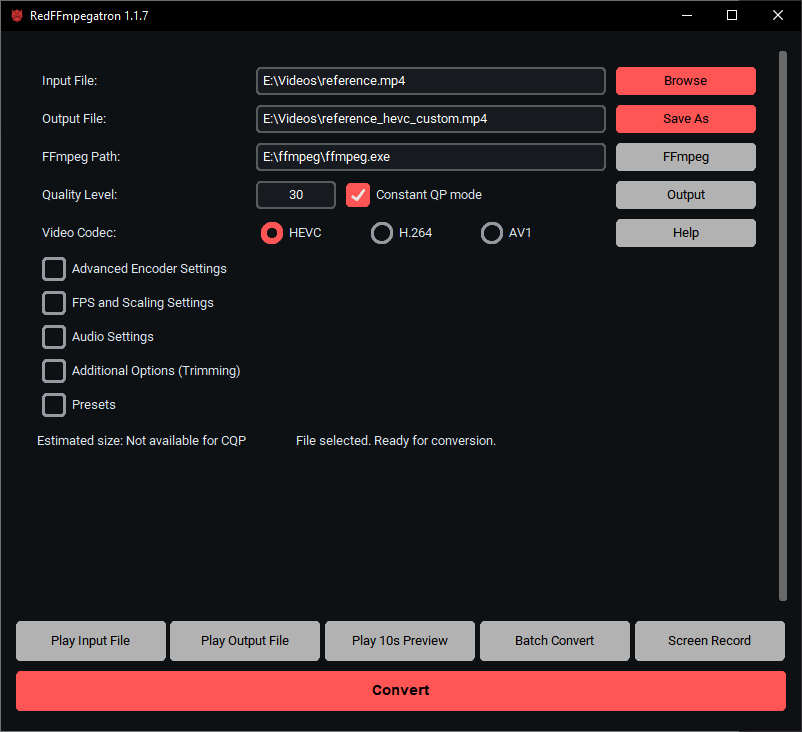

# RedFFmpegatron 🚀

## Table of Contents
- [About the Project](#about-the-project)
- [Features](#features)
- [Getting Started](#getting-started)
  - [Prerequisites](#prerequisites)
  - [Installation](#installation)
  - [Building Executable (For Developers)](#building-executable-for-developers)
- [Usage](#usage)
- [Contributing](#contributing)

---

## About The Project

A Python GUI for **FFmpeg** with **AMD AMF hardware encoding** (HEVC / H.264 / AV1).  
It provides a simple dark-themed interface with drag-and-drop support, presets, trimming, previews, and advanced encoder/audio/FPS options – no need to manually write FFmpeg commands.

---

## Features

- **Drag and drop** video files into the window
- **Codec support:** HEVC (H.265), H.264, AV1 via AMF
- **Bitrate mode** or **Constant QP mode**
- **Audio settings:** disable, copy, AAC (96k / 160k / 256k) or custom
- **Advanced encoder options:**
  - Usage (transcoding, lowlatency, ultralowlatency, high_quality, etc.)
  - Quality presets (speed, balanced, quality)
  - Profiles (main, main10)
  - Levels and tiers
  - Rate-control (cbr, vbr, hqvbr, qvbr, etc.)
  - AMF-specific toggles: Preanalysis, VBAQ, Enforce HRD
- **FPS and scaling settings**
  - Change FPS (source, 60, 50, 30, 23.976, custom)
  - Resize to HD/FHD/QHD/4K/Custom width
  - Interpolation algorithms (bilinear, bicubic, lanczos, spline, etc.)
- **VideoSR (super-resolution)**
  - Algorithms, sharpness, ratio controls, pixel format selection
- **Additional options**
  - Trimming with start/end time
  - Streamcopy mode
  - Add custom FFmpeg options
  - Video filters (crop, eq, unsharp, saturation, HDR→SDR, etc.)
  - Audio filters (atempo, loudnorm, etc.)
- **Presets system** for quick configuration
- **10-second preview** encoding with current settings
- **Estimated output size** (bitrate mode only)
- **Built-in player buttons:** Play Input, Play Preview, Play Output
- **Command preview** – shows full FFmpeg command, editable, copyable


---

## Getting Started

### Requirements

- Windows OS (uses Win32 drag-and-drop)
- Python 3.10 or newer
- FFmpeg build with AMF support (`ffmpeg.exe`, `ffprobe.exe`)
- Python dependencies:
  - `customtkinter`
  - `Pillow`
  - `pywin32`

Install dependencies with:

```bash
pip install customtkinter pillow pywin32
```

---

## Usage

1. Download or build FFmpeg with AMF support and place `ffmpeg.exe` in PATH or select it in the app.
2. Run the program:

```bash
python RedFFmpegatron.py
```

3. Drag & drop a video file or use the **Browse** button.
4. Select codec, bitrate/quality, audio, and encoder options.
5. Press **Convert** to start encoding.
6. Optionally use **Play 10s Preview** before running full conversion.

---

## Example FFmpeg commands

Encoding to HEVC (H.265) with AMF at 6 Mbps:

```bash
ffmpeg -hwaccel auto -i input.mp4 -c:v hevc_amf -b:v 6000k -c:a copy output_hevc.mp4
```

Encoding with Constant QP mode (Quality 30):

```bash
ffmpeg -hwaccel auto -i input.mp4 -c:v hevc_amf -qp_i 30 -qp_p 30 -c:a copy output_cqp.mp4
```

The GUI automatically builds commands like these based on your settings.

---

## Notes

- This app is designed for AMD GPUs that support **AMF hardware encoding**.
- For NVIDIA GPUs use [NVENCFF Toolbox](https://gitlab.com/hadoukez/nvencff-toolbox).
- The tool is intended for Windows only.
